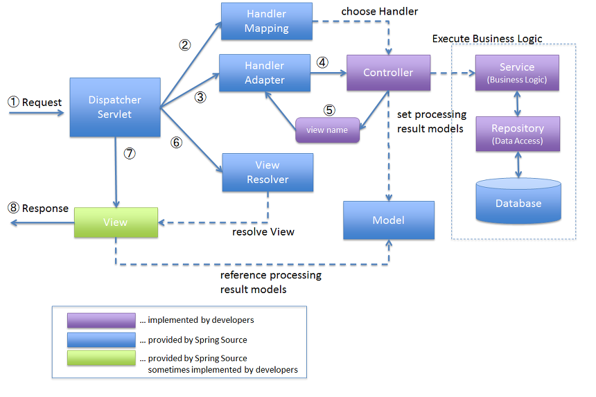
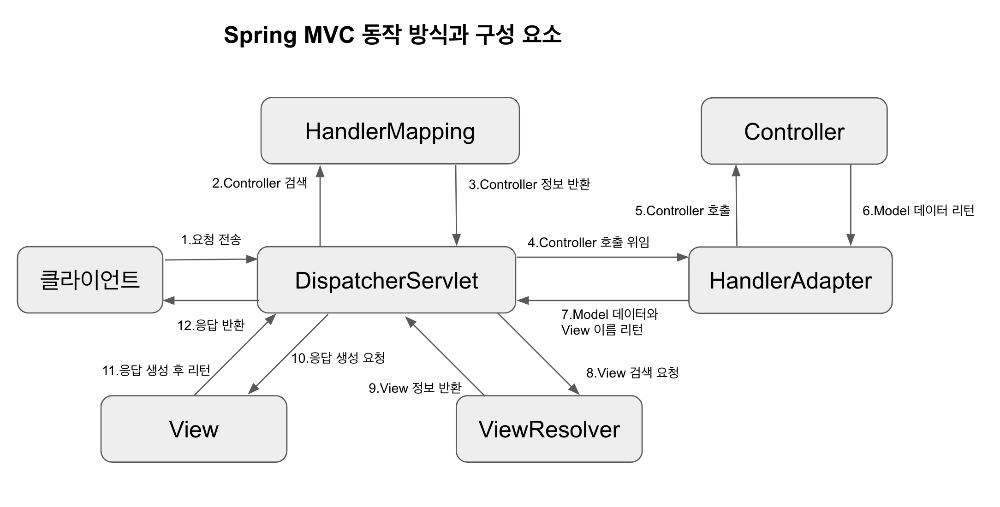

# 스프링
> - java 애플리케이션 개발을 편하게 할 수 있게 해주는  애플리케이션 프레임 워크다.( 애플리케이션을 개발하는 데에 있어 필요한 모든 업무 분야 및 모든 기술과 관련된 코드들의 뼈대를 제공합니다.)

----------------------------------------
# 특징
1. poJo 프로그래밍을 지향  (POJO란  Java 및 Java의 스펙에 정의된 기술만 사용한다)
> poJO 의 장점
>> 1. 외부 기술이나 규약의 변화에 얽매이지 않는다.
>>>2. 코드가 단순해진다.
2. IoC / DI
> 개발자가 아닌 스프링이  사용할 객체를 생성하여 의존관계를 맺어주는 것을 Ioc라고 한다(의존 관계란 A가 B의 기능을 가져다가 사용하는 것을 말한다.)
 >> 여기서 A가 사용할 객체를 B가 아니라, 새롭게 c를 정의해서 사용하고자 한다면 A의 코드를 변경할 수밖에 없을것이다. 이런 불편을 줄여주는 것이 스프링 이다.
>>> DI는 하나의 객체에 다른 객체의 의존 관계 을 제공하는 기술이다.
--------------------------------------
3. AOP
* 핵심 관심 사항 과 공통 관심 사항으로 분류할수 있습니다. 핵심 관심 사항은 핵심 기능이고 공통 관심 사항은 핵심 기능에 공통으로 적용되는 것 입니다. 코드가 중복을 줄이고 중복된 부분을 비즈니스 로직으로부터 분리해내는 것 입니다.
* 장점은 비즈니스 로직에 집중할수 있습니다.
---------------------------------------
1. JDBC
2.  자바에서 데이터베이스에 접속할 수 있도록 하는 자바 API(자바와 데이스베이스를 연결 하는데 사용된다.)이다.
-----------------------------------------------
5. PSA
* JDBC 처럼  특정 기술과 관련된 서비스를 추상화하여 환경의 변화와 관계없이  일관된 방식으로 사용될 수 있도록 한 것 입니다.

---------------------------------------------
# 스프링 부트 란?
*  스프링 부트는 스프링으로 애플리케이션을 만들 때에 필요한 설정을 간편하게 처리해주는 별도의 프레임워크입니다
# 라이브러리 
- 라이브러리: 공통으로 사용될 수 있는 특정한 기능 들을 모듈화한 것이다.

- 서로서로의 기능들이 필요하다면 전부 다 끌어와서 쓰는 것이다.
# 스프링 동작 원리

1. 애플리케이션으로 들어오는 모든 Request를 받는 부분. Request를 실제로 처리할 Controller에게 전달하고 그 결과값을 받아서 View에 전달하여 적절한 응답을 생성할 수 있도록 흐름을 제어 한다.
2. HandlerMapping는 Request URL에 따라 각각 어떤 Controller가 실제로 처리할 것인지 찾아주는 역할을 한다.
3. controller는 Request를 직접 처리한 후 그 결과를 다시 DispatcherServelt에 돌려준다.
4.  ModelAndView는 Controller가 처리한 결과와 그 결과를 보여줄 View에 관한 정보를 담고 있는 객체이다.
5. ViewResolver는 View 관련 정보를 갖고 클라이언트에게 포워딩할 실제 View 파일을 찾아주는 역할을 한다.
6. view는 Controller가 처리한 결과값을 보여줄 View를 생성한다. 
- 위와 같이 기본적으로 MVC2의구조를 따른다.
 
 